# RocketLogger

#### Developed by Kristian Lauszus and Mads Bornebusch, 2019

The code is released under the GNU General Public License.
_________
[](https://travis-ci.com/Lauszus/RocketLogger)

Log pressure, acceleration and angular velocity of a model rocket using an ESP8622 via a simple webinterface.

## Plots

Here's the altitude and acceleration plots of a misfire, thus it only reached ~35 meter:

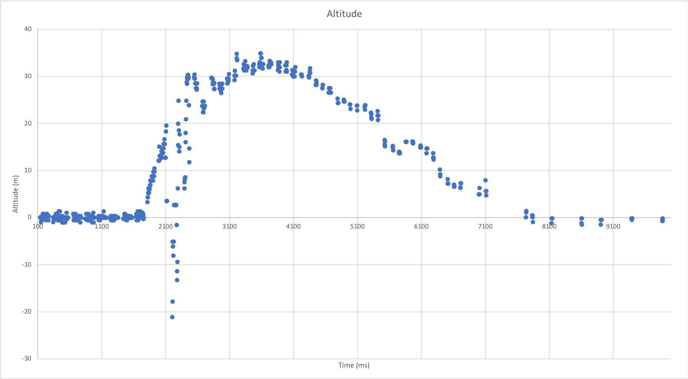
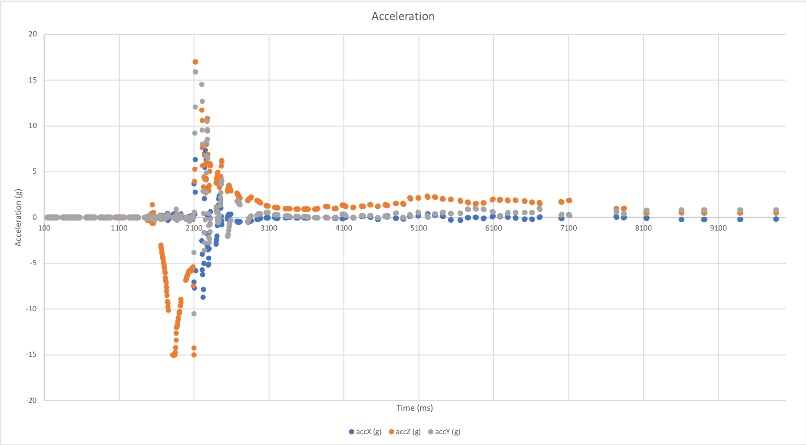

__TODO: Plots from a successful launch__

## User guide

The ESP simply sets up a hotspot named ```Rocket``` with the password ```rocketsrocks```.

After that simply navigate to ```192.168.4.1``` to start a new log:

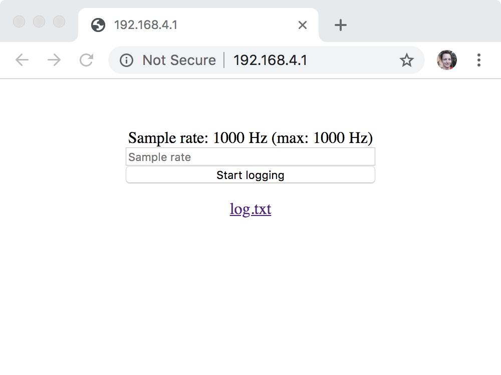

The log will automatically close when the file system is full. The log can also be stopped manually:

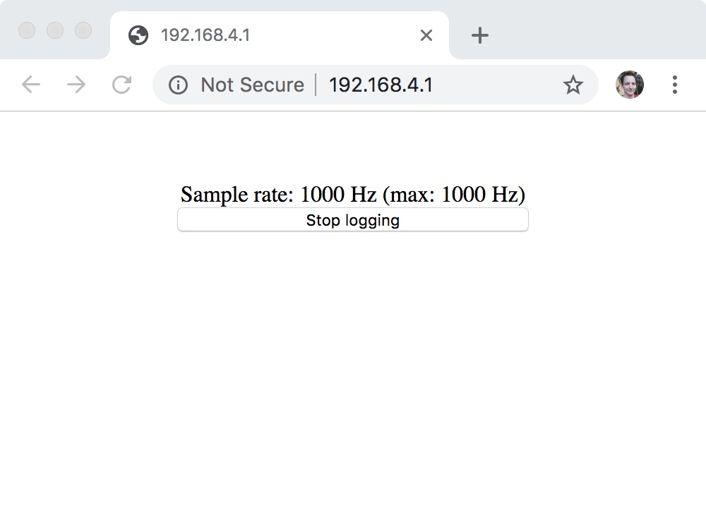

Finally the CSV file can be viewed and downloaded for further analysis:

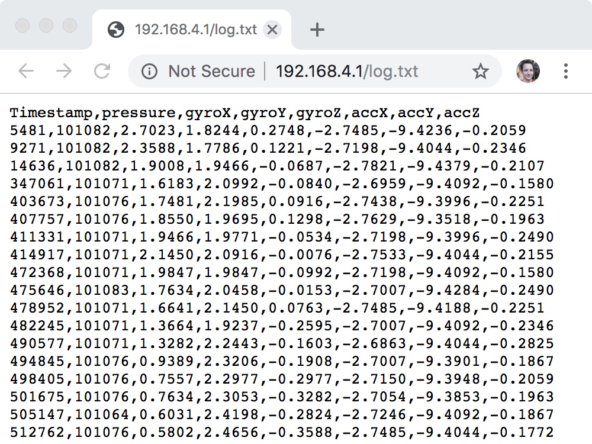

## Hardware

The hardware consist of an ESP8622 (ESP-01 variant for its small size), a [MPU-6500](https://www.invensense.com/products/motion-tracking/6-axis/mpu-6500/) (3-axis accelerometer and 3-axis gyroscope) and [MS5611](https://www.te.com/commerce/DocumentDelivery/DDEController?Action=showdoc&DocId=Data+Sheet%7FMS5611-01BA03%7FB3%7Fpdf%7FEnglish%7FENG_DS_MS5611-01BA03_B3.pdf%7FCAT-BLPS0036) (barometer). The voltage from a 1S LiPo is stepped down to 3.3V using a [LT1763CS8-3.3](https://www.analog.com/media/en/technical-documentation/data-sheets/1763fh.pdf).

All the components are simply soldered together and glued onto the battery. The whole package is then placed inside the rocket:

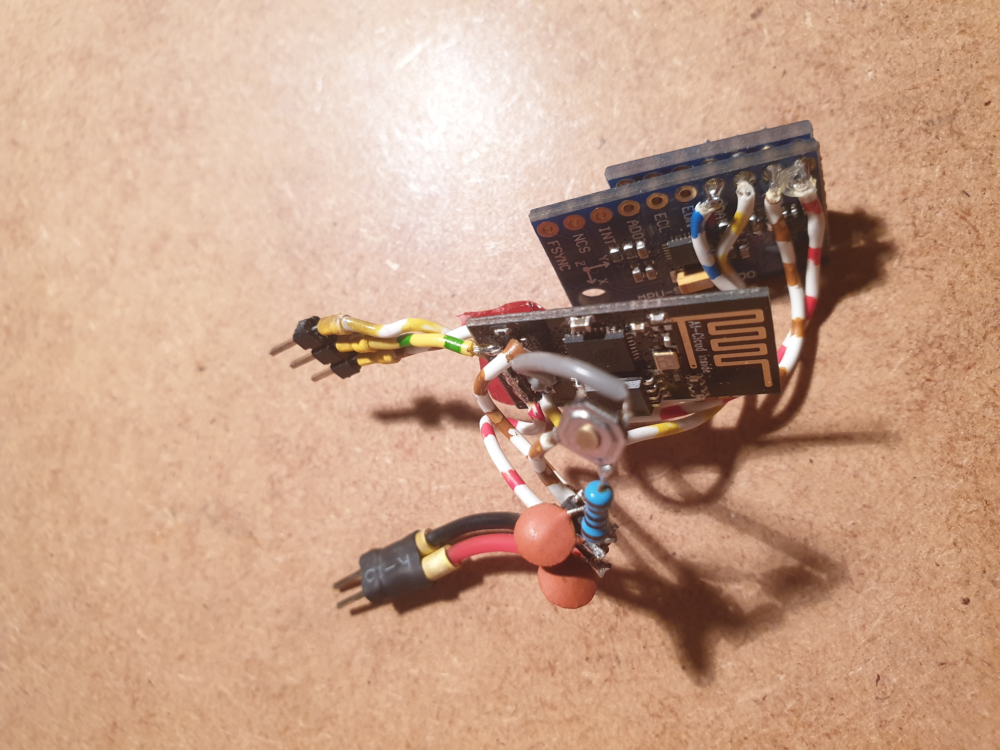
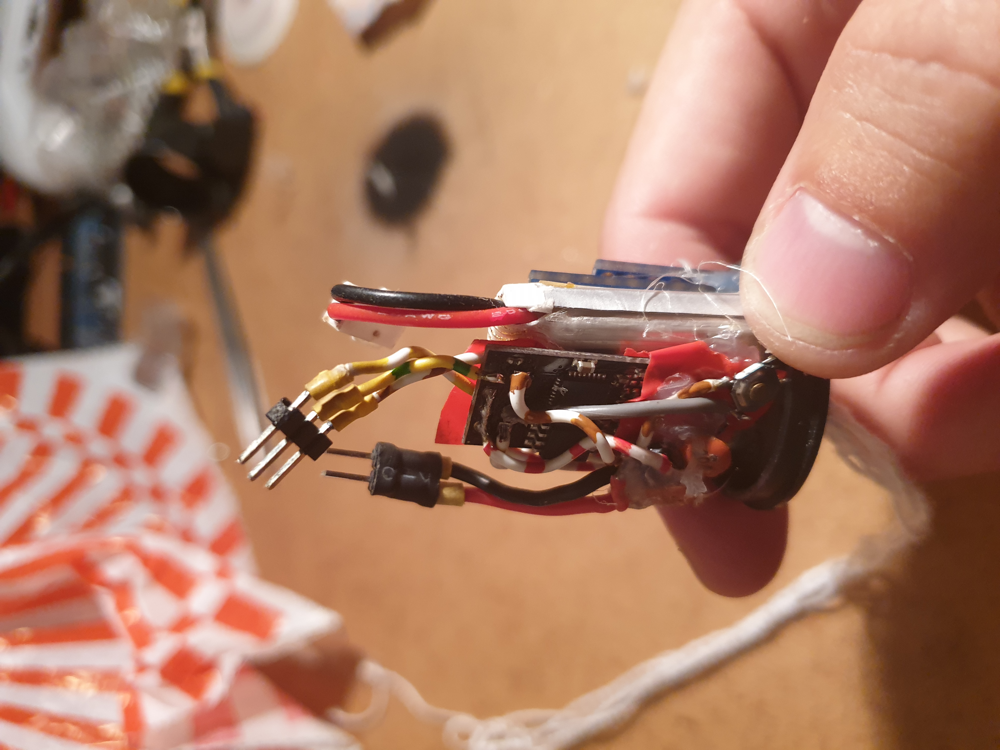

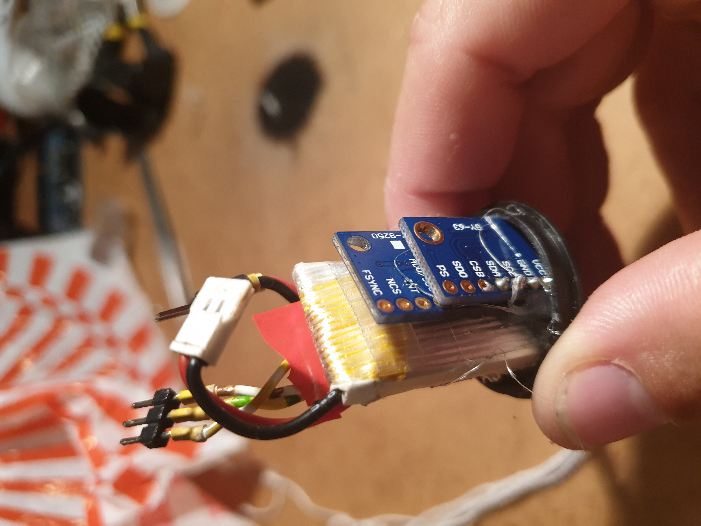
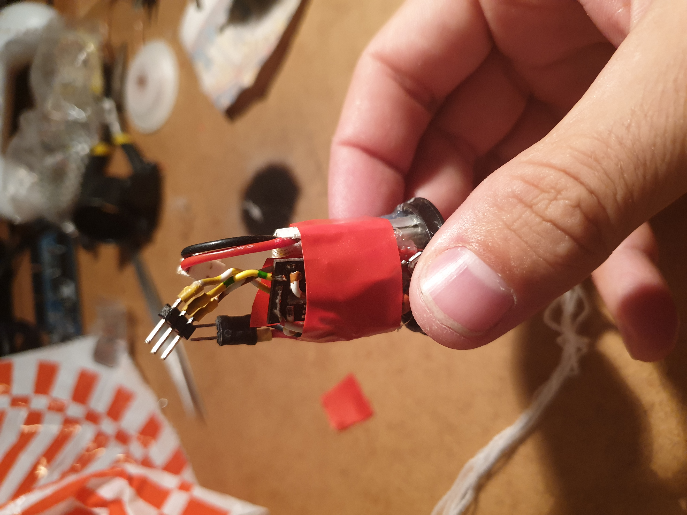

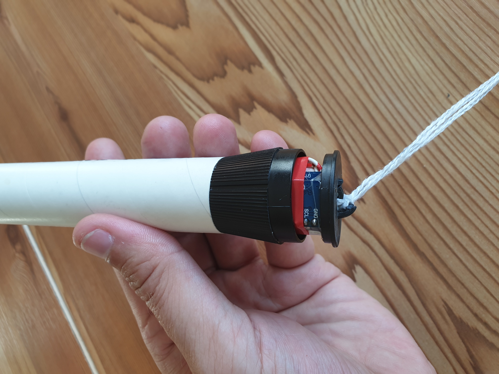
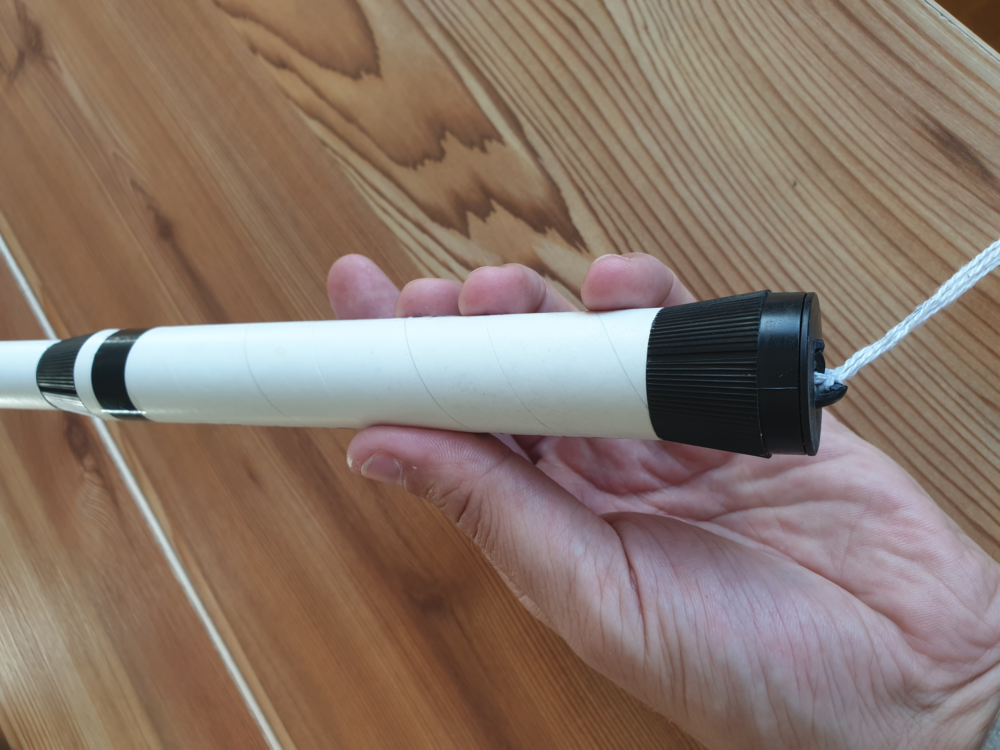
